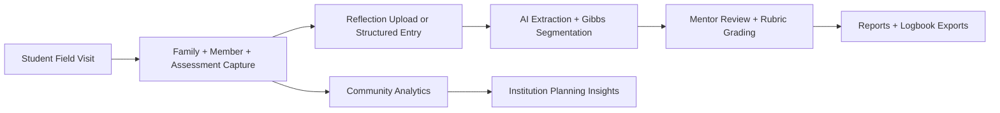
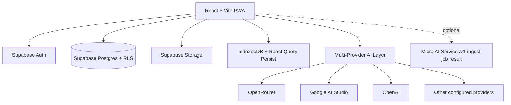

# FAP Next Generation

**AI-enabled digital platform for the Family Adoption Programme (FAP) under NMC-CBME**

[](https://fap-nextgen-app.vercel.app)
[](https://react.dev)
[](https://supabase.com)
[](#architecture)
[](#ai-core-gibbs-reflective-learning-engine)


## Live Demo Links

- Live application: https://fap-nextgen-app.vercel.app
- Summit demo video: https://drive.google.com/file/d/1bUuuoM_xp_lIhGCuo_-dW5zvyExifNL2/view

## Why This Project Exists

Family Adoption Programme implementation in many institutions is still paper-heavy, fragmented, and difficult to audit at scale.  
FAP Next Generation was built to convert mandatory fieldwork into:

- better student learning quality
- stronger mentor oversight
- cleaner institution-level evidence
- actionable community health intelligence

## Vision Statement

Move from paper logbooks to a longitudinal, AI-assisted learning and public-health intelligence system for community medicine training in India.

## Journey: From Start to Current State

| Stage | Focus | Outcome |
|---|---|---|
| Phase 1 | Digital family records and field logbook workflows | End-to-end student capture of family, visit, and assessment data |
| Phase 2 | Role-based governance and mentor workflows | Student, Teacher, Admin pathways with review and grading loops |
| Phase 3 | AI integration for reflection quality | Gibbs-cycle extraction, quality flags, safety controls, confidence metadata |
| Phase 4 | Programmatic scale readiness | Multi-provider AI keys, fallback controls, offline-first sync, exportable reports |

## Platform At a Glance



## Architecture



## Core Modules

- Student Dashboard
  - adopted families, population, issues, activity summary
- Family Folder
  - family + member records, longitudinal continuity, visit logs
- Structured Assessments
  - NCD, socio-economic, nutrition, mental health, maternal-child focused forms
- Reflections
  - structured entry or upload, AI segmentation into Gibbs stages
- Learning Objectives
  - competency-linked objectives and expected activities
- AI Medical Coach
  - context-aware guidance for community medicine scenarios
- Community Health Profile
  - overview, demography, resources, annual planning, health status
- Mentor Workspace
  - pending reviews, AI-segmented entries, rubric-based assessment
- Admin Portal
  - user management, role governance, provider/system settings
- Reports & Logbook
  - print/export workflows and summary analytics

## AI Core: Gibbs Reflective Learning Engine

The reflection engine is designed for **formative learning quality**, not just text generation.

- input modes:
  - structured typing
  - uploaded file extraction (doc/pdf/image pipeline)
- stage mapping:
  - Description
  - Feelings
  - Evaluation
  - Analysis
  - Conclusion
  - Action Plan
- quality intelligence:
  - missing-stage flags
  - section-length checks
  - confidence scores
  - evidence spans
  - safety disclaimers and diagnosis-claim guardrails
- reliability controls:
  - provider fallback policies
  - micro-AI pipeline preference toggle
  - AI audit/version tables for traceability

## Feature Matrix

| Area | Capability | Benefit |
|---|---|---|
| Data Capture | Family, member, visit, assessment logging | Continuity of care and complete field documentation |
| AI Reflection | Gibbs segmentation + quality checks | Better reflective depth and clinical reasoning |
| Mentor Tools | Pending triage + rubric scoring | Higher feedback quality with less administrative load |
| Community View | Population and health indicator summaries | Program-level planning and public health insight |
| Reports | Exportable logbook and summaries | Compliance-ready outputs for reviews and assessment |
| Operations | Role-based access + RLS | Privacy, governance, and secure scale |
| Connectivity | Offline-first patterns + sync | Reliable use in low-connectivity environments |

## National Alignment

| National Priority / Framework | Alignment in FAP Next Generation |
|---|---|
| NMC CBME (UGME 2023 context) | Structured competency-linked workflows and longitudinal field documentation |
| Family Adoption Programme (FAP) | Purpose-built digital execution of family-level community immersion |
| Public health priority programs | NCD, maternal-child, nutrition, TB-oriented community workflows and resources |
| Ayushman Bharat direction | Strengthens primary-care community data practices at grassroots level |
| ABDM-ready ecosystem thinking | ABHA-linked fields and interoperability-oriented architecture path |
| Digital health governance | Role-based controls, auditability, institution-level manageability |

## Benefits by Stakeholder

### Students
- stepwise reflective learning support
- easier field documentation and continuity
- better preparation for competency-based evaluations

### Mentors / Faculty
- targeted review on high-priority submissions
- rubric consistency across cohorts
- reduced manual burden

### Institutions
- auditable, exportable records
- stronger quality monitoring
- better evidence for academic and administrative review

### Public Health Systems
- structured community-level signals from routine educational fieldwork
- potential for improved local planning and early trend visibility

## Technology Stack

| Layer | Stack |
|---|---|
| Frontend | React, Vite, React Router |
| Offline & Cache | IndexedDB, React Query persistence, PWA |
| Backend | Supabase (PostgreSQL, Auth, Storage, RLS) |
| AI Layer | Multi-provider key architecture (OpenRouter, Google, OpenAI, and others) |
| Optional AI Microservice | FastAPI + async job endpoints (`/v1/ingest`, `/v1/job/{id}`, `/v1/result/{id}`) |
| Deployment | Vercel |

## Quick Start

### 1) Prerequisites

- Node.js 18+
- npm
- Supabase project
- at least one AI provider API key

### 2) Clone and install

```bash
git clone https://github.com/hssling/FAP_Nextgen_App.git
cd FAP_Nextgen_App
npm install
```

### 3) Configure environment

Create `.env` from `.env.example` and set the values:

```env
VITE_SUPABASE_URL=...
VITE_SUPABASE_ANON_KEY=...
VITE_OPENROUTER_API_KEY=...
VITE_GOOGLE_AI_KEY=...
VITE_OPENAI_API_KEY=...
VITE_MISTRAL_API_KEY=...
VITE_XAI_API_KEY=...   # or VITE_xAI_API_KEY
VITE_CEREBRAS_API_KEY=...
VITE_HUGGINGFACE_API_KEY=...
VITE_MICRO_AI_BASE_URL=http://localhost:8000
```

### 4) Run

```bash
npm run dev
```

### 5) Build

```bash
npm run build
npm run preview
```

## Security, Privacy, and Ethics

- Supabase Auth + role-based route protection
- Row Level Security policies for data isolation
- local key management options for AI providers
- safety boundary in AI outputs:
  - decision-support framing
  - anti-definitive-diagnosis guardrails

## Repository Structure

```text
src/
  components/
  contexts/
  data/
  pages/
  services/
  utils/
supabase/
micro_ai_service/
```

## Roadmap Potential

- multilingual UI and reflection support (regional language-first workflows)
- deeper longitudinal analytics and cohort benchmarking
- stronger PHC/CHC decision dashboards
- interoperability expansion for broader digital health ecosystems
- institution-scale onboarding automation

## Documentation Archive

- Previous README archived as: `README_ARCHIVE_2026-02-15.md`

## Acknowledgement

Developed as a community medicine and medical education innovation aligned to the goals of competency-based training and digitally enabled public health practice.
